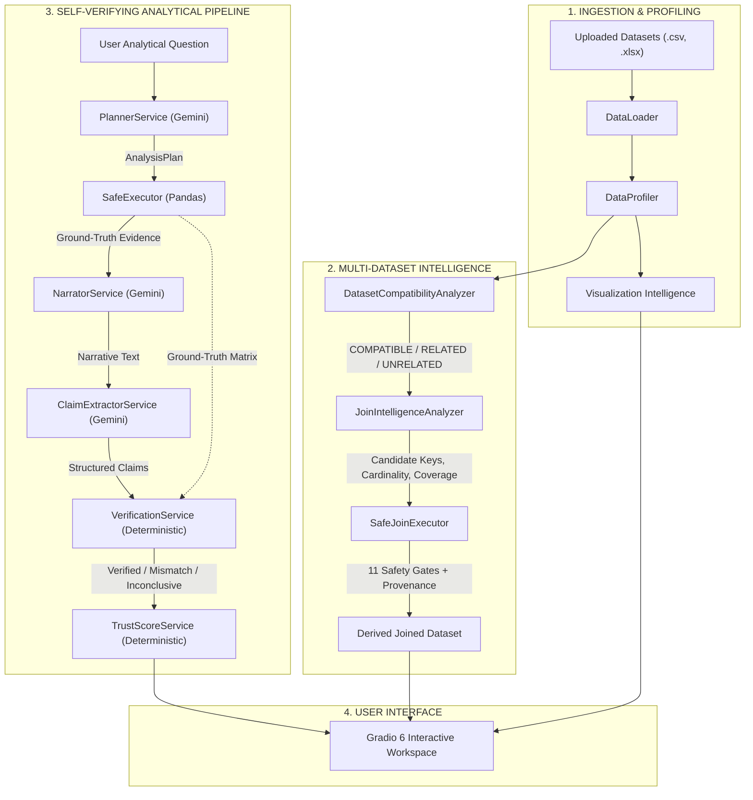

# 🔍 VeriLens AI — Self-Verifying LLM Data Analyst

[](https://www.python.org/)
[]()
[](https://deepmind.google/technologies/gemini/)
[](https://www.gradio.app/)
[](https://opensource.org/licenses/MIT)

> **A self-verifying LLM-powered data analysis system that separates probabilistic language-model reasoning from deterministic data computation and verification.**

```
       LLM = Reasoning  │  Pandas = Computation  │  Verifier = Trust
Profile → Relate → Validate → Safely Join → Verify → Explain with Provenance
```

---

## 📖 Overview

Language models possess remarkable linguistic fluency and reasoning capabilities, but they are inherently probabilistic. When tasked with analyzing quantitative data, traditional LLM systems suffer from a severe architectural flaw: **numerical hallucination**. They frequently invent plausible-sounding metrics, misaggregate column values, confuse filtered subsets with population totals, and deliver erroneous figures with absolute confidence. In enterprise data analytics, unverified numbers are unacceptable.

**VeriLens AI** re-architects data analysis by strictly separating language reasoning from mathematical computation:

- **LLMs are never trusted with numerical computation, statistical aggregation, or join execution.**
- **A controlled deterministic Pandas execution engine (`SafeExecutor`) executes strictly validated analytical plans.**
- **A deterministic verification engine (`VerificationService`) extracts numerical and relational claims from generated narratives and verifies every single claim against computed ground truth.**
- **Every analytical output is scored with a deterministic Trust Score (0–100) alongside claim-level verification badges and traceable ground-truth evidence tables.**
- **Multi-dataset workspaces evaluate compatibility, validate join keys, and execute safe joins with complete dataset provenance and anti-spoofing protection.**

VeriLens AI does not make speculative claims of "zero hallucinations." Instead, it delivers **deterministic verification of supported analytical claims against computed ground truth**.

---

## ⚡ What Makes VeriLens Different

### Traditional LLM Data Assistant (Black-Box Probability)

```text
User Question ───► [ LLM (Guesses Math, Hallucinates Numbers) ] ───► Unverified Answer
```
*The LLM computes in its weights. If it miscalculates, quotes outdated facts, or misreads rows, the user has zero ability to detect the error.*

### VeriLens AI Architecture (Deterministic Ground-Truth Verification)

```text
User Question + Dataset(s)
          │
          ▼
   LLM Planner (Gemini) ─────────────► Translates question into structured AnalysisPlan
          │
          ▼
   SafeExecutor (Pandas) ────────────► Deterministic computation; produces Ground Truth Evidence
          │
          ▼
   NarratorService (Gemini) ─────────► Generates natural-language explanation grounded in Evidence
          │
          ▼
   ClaimExtractorService (Gemini) ───► Deconstructs narrative into granular AnalyticalClaim objects
          │
          ▼
   VerificationService (Deterministic)► Evaluates claims against Ground Truth with strict tolerances
          │
          ▼
   TrustScoreService (Deterministic) ─► Computes objective Trust Score (0–100) and audit breakdown
          │
          ▼
   Interactive Gradio Dashboard ─────► Answer + Trust Score + Claim Badges + Ground Truth Evidence
```

---

## 🏛️ Core Architecture



### Pipeline Component Responsibilities

| Stage | Component | Underlying Engine | Responsibility |
| :--- | :--- | :--- | :--- |
| **Ingestion** | `DataLoader` | Pandas, OpenPyXL | Validates encodings, sheets, empty files, and attaches source filename provenance. |
| **Profiling** | `DataProfiler` | Pandas, NumPy | Computes statistical summaries, missingness, memory footprint, candidate keys, and temporal types. |
| **Visualization** | `DataVisualizer` & `VisualizationIntelligence` | Plotly, Heuristic Engine | Generates candidate charts, applies deterministic suitability filters, and renders interactive plots. |
| **Compatibility** | `DatasetCompatibilityAnalyzer` | Deterministic Rules | Classifies dataset pairs as `COMPATIBLE`, `RELATED`, or `UNRELATED` without premature merging. |
| **Join Intelligence** | `JoinIntelligenceAnalyzer` | Deterministic Set Operations | Discovers candidate join keys, tests uniqueness, measures coverage, and classifies cardinality. |
| **Safe Join** | `SafeJoinExecutor` | Controlled Pandas Merge | Enforces 11 pre-join safety gates, original DataFrame preservation, anti-spoofing provenance, and post-join validation. |
| **Planning** | `PlannerService` | Gemini 2.5 Flash | Interprets analytical intent into a strict, validated JSON `AnalysisPlan`. |
| **Computation** | `SafeExecutor` | Controlled Pandas | Executes groupby, aggregations, filters, sorting, and top-k operations deterministically. |
| **Narration** | `NarratorService` | Gemini 2.5 Flash | Formulates an executive explanation strictly bounded by computed ground truth. |
| **Claim Extraction** | `ClaimExtractorService` | Gemini 2.5 Flash | Extracts granular `AnalyticalClaim` objects (`subject`, `metric`, `value`, `comparison`). |
| **Verification** | `VerificationService` | Python / Math Algorithms | Verifies every claim against ground truth using strict numerical tolerances and ranking checks. |
| **Trust Scoring** | `TrustScoreService` | Deterministic Algorithm | Calculates transparent Trust Score (0–100) based on verified, mismatch, and inconclusive claims. |

---

## 🛡️ Self-Verification Engine

The self-verification engine operates on the principle that **supported analytical claims are verified against computed ground-truth evidence before being assigned a verification status**:

1. **Structured Plan Generation:** `PlannerService` converts the query into an `AnalysisPlan` containing:
   - `aggregations`: `[{"column": "Profit", "agg": "sum"}]`
   - `group_by`: `["Region"]`
   - `sort_by`: `[{"column": "Profit", "ascending": false}]`
   - `limit`: `5`
2. **Deterministic Execution:** `SafeExecutor` executes this plan in Pandas, producing raw ground-truth DataFrame evidence.
3. **Grounded Narrative:** `NarratorService` produces an explanation citing specific numbers and findings.
4. **Structured Claim Extraction:** `ClaimExtractorService` parses the narrative into atomic statements:
   ```json
   {
     "subject": "West",
     "metric": "Profit",
     "value": 108418.45,
     "comparison": "highest",
     "group_by": "Region"
   }
   ```
5. **Deterministic Verification:** `VerificationService` evaluates each claim against the ground truth matrix:
   - **Ranking Claims:** Verifies whether the subject is mathematically `highest` or `lowest`.
   - **Numerical Claims:** Compares values with strict floating-point relative and absolute tolerances ($\le 1\%$).
   - **Relational Claims:** Evaluates `greater_than`, `less_than`, and `equal` comparisons.
6. **Status Assignment:**
   - `VERIFIED` (✅): The claim mathematically matches ground truth.
   - `MISMATCH` (❌): The claim contradicts computed numbers (e.g. LLM miscalculated or hallucinated).
   - `INCONCLUSIVE` (⚠️): The claim cannot be verified from the computed evidence subset.
7. **Trust Score Calculation:**
   $$\text{Trust Score} = \frac{(\text{Verified Claims} \times 100) + (\text{Inconclusive Claims} \times 50) + (\text{Mismatch Claims} \times 0)}{\text{Total Claims}}$$
   The final Trust Score is the deterministic arithmetic mean of all individual claim scores (`VERIFIED` = 100, `INCONCLUSIVE` = 50, `MISMATCH` = 0), rounded to 2 decimal places:
   - **High trust** ($90.0 - 100.0$)
   - **Moderate trust** ($70.0 - 89.99$)
   - **Low trust** ($50.0 - 69.99$)
   - **Very low trust** ($0.0 - 49.99$)

---

## 📊 Dataset-Agnostic Automated EDA

VeriLens AI operates out of the box on arbitrary tabular datasets without prior schema configuration:

- **Format Support:** CSV files (`.csv`) with automatic encoding detection (`utf-8`, `latin1`, `cp1252`) and Excel workbooks (`.xlsx`) with active sheet auto-detection.
- **Statistical Profiling:** Row counts, column counts, memory usage, duplicate row detection, column dtypes, and missing value percentages.
- **Semantic Type Identification:**
  - Continuous numerical measures (`float64`, non-identifier `int64`).
  - Categorical dimensions with low-to-medium cardinality.
  - Chronological time dimensions (parsed `datetime` and ISO-formatted date strings).
- **Identifier Exclusion:** Intelligent heuristics exclude index-like row counters, phone numbers, postal codes, and database primary keys from being mistakenly analyzed as statistical measures.

---

## 📈 Visualization Intelligence

Rather than producing generic, repetitive charts, VeriLens features a dedicated **Visualization Intelligence Engine**:

```text
Dataset Profile
      │
      ▼
Candidate Generator ──────► Proposes valid chart candidates across supported schemas
      │
      ▼
Suitability Rules ────────► Filters out unusable high-cardinality keys, IDs, and empty fields
      │
      ▼
Semantic Ranking ─────────► Evaluates analytical diversity (Optional Gemini / Deterministic Fallback)
      │
      ▼
Plotly Rendering ─────────► Renders 4 high-contrast, interactive visualizations
```

### Supported Visualizations
- **Categorical Distributions:** Bar charts of dominant business metrics grouped by primary dimensions.
- **Proportional Compositions:** Donut and pie charts for low-cardinality categorical compositions ($\le 7$ categories).
- **Chronological Trends:** Line charts and time series tracking metrics across date/time dimensions.
- **Value Distributions:** Histograms showing frequency spread, skewness, and outliers.
- **Multi-Variable Relationships:** Scatter plots correlating continuous numerical pairs.

---

## 📂 Multi-Dataset Workspace

Data analysts rarely work with a single isolated CSV. VeriLens AI provides a unified multi-dataset workspace allowing simultaneous ingestion and cross-dataset intelligence:

```text
Multiple Files Uploaded (.csv / .xlsx)
                  │
                  ▼
      Independent Dataset Profiling
                  │
                  ▼
Pairwise Compatibility & Relationship Analysis
                  │
     ┌────────────┼────────────┐
     ▼            ▼            ▼
COMPATIBLE     RELATED     UNRELATED
(Union/Append)  (Join Key)  (Distinct)
                  │
                  ▼
       Safe Join Intelligence
```

### Core Design Principle
> **VeriLens does not assume that multiple uploaded files should be merged.** Uploading datasets or detecting relationships **never** triggers an automatic join. Relationships are evidence-backed hypotheses presented for user evaluation.

---

## 🔗 Relationship Intelligence

Pairwise dataset relationships are classified deterministically:

- **🟢 COMPATIBLE:** Datasets share high schema similarity ($\ge 80\%$), matching column headers, and compatible data types. Suitable for append, union, or multi-period comparative analysis.
- **🔗 RELATED:** Datasets exhibit structural divergence but share candidate business keys with verified value overlap. Suitable for safe join analysis.
- **⚪ UNRELATED:** Datasets lack structural or identifier overlap; no safe join or union relationship exists.

---

## 🔑 Candidate Key Safety

A critical risk in automated joins is mistaking sequential row indices or export artifacts for meaningful business keys. VeriLens implements strict candidate-key guards via `ColumnNormalizer`:

- **Blocked Key Patterns:** `index`, `idx`, `row_num`, `row_number`, `row_id`, `record_id`, `record_num`, `unnamed: 0`.
- **Sequential Index Detection:** Integer columns that simply count sequential rows ($1, 2, 3, \dots, N$) are disqualified from join recommendations.
- **Protected Business Identifiers:** Legitimate business identifiers such as `customer_id`, `order_id`, `product_id`, `SKU`, and `ASIN` are recognized through normalized regex patterns and value uniqueness.

---

## ⚡ Safe Join Intelligence

For datasets classified as `RELATED`, the `JoinIntelligenceAnalyzer` produces a deterministic, evidence-based recommendation **without executing any join**:

### Evaluated Properties
1. **Key Discovery & Normalization:** Identifies common candidate business keys across both tables.
2. **Data Type Compatibility:** Verifies that join key representations can be safely aligned.
3. **Null Analysis:** Audits null percentages on both sides; high null rates incur safety penalties.
4. **Value Overlap & Coverage:** Measures exact set intersection of distinct key values:
   $$\text{Coverage \%} = \frac{|Keys_{left} \cap Keys_{right}|}{\min(|Keys_{left}|, |Keys_{right}|)} \times 100$$
5. **Cardinality Classification:**
   - `ONE_TO_ONE`: Key is strictly unique on both sides.
   - `ONE_TO_MANY`: Key is unique on the left side (parent) and duplicated on the right (child).
   - `MANY_TO_ONE`: Key is duplicated on the left side (child) and unique on the right (parent).
   - `MANY_TO_MANY`: Key is duplicated on both sides (**strictly blocked from execution**).
   - `UNKNOWN`: Insufficient evidence to determine cardinality.
6. **Deterministic Confidence Score (0–100):**
   - High identifier confidence + high coverage ($\ge 75\%$) $\to$ `HIGH` ($\ge 80\%$).
   - Moderate coverage ($\ge 50\%$) $\to$ `MODERATE` ($60–79\%$).
   - Weak overlap $\to$ `LOW` ($40–59\%$) or `VERY LOW` ($< 40\%$).
7. **Join Type Recommendation:** Recommends `LEFT_JOIN`, `INNER_JOIN`, `RIGHT_JOIN`, `FULL_OUTER_JOIN`, or `NO_SAFE_JOIN`.

*Gemini is never permitted to calculate or override coverage, uniqueness, cardinality, or safety flags.*

---

## 🚀 Safe Join Execution & Anti-Spoofing

`SafeJoinExecutor` represents the only layer in VeriLens permitted to execute a `pandas.merge()`. Execution is guarded by **11 pre-join safety gates**:

```text
Join Recommendation (Phase 2)
              │
              ▼
    11 PRE-JOIN SAFETY GATES
    ├─ 1. Recommendation exists
    ├─ 2. Recommended join != NO_SAFE_JOIN
    ├─ 3. safe_to_execute == True
    ├─ 4. Explicit user approval granted
    ├─ 5. Dataset Identity & Provenance Verification (Anti-Spoofing)
    ├─ 6. Controlled join type (LEFT, INNER, RIGHT, OUTER)
    ├─ 7. Requested join matches approved recommendation
    ├─ 8. Left column exists in left DataFrame
    ├─ 9. Right column exists in right DataFrame
    ├─ 10. Direct Many-to-Many Guard (nunique check on actual data)
    └─ 11. Key columns are not index-like / row counters
              │
         [ All Pass? ]
          ├── NO  ──► Block Execution (pandas.merge is NEVER called)
          └── YES ──► Execute pandas.merge(how=type, suffixes=('_left', '_right'))
                           │
                           ▼
                  Post-Join Validation
                  (Row counts, multiplication factor, duplicate expansion)
                           │
                           ▼
                  Derived Joined Dataset + Provenance Metadata
```

### Authoritative Dataset Provenance & Anti-Spoofing Protection
- **Authoritative Dataset Provenance:** When files are loaded via `DataLoader`, source metadata is attached to the DataFrame (`df.attrs["filename"]`). `SafeJoinExecutor` treats DataFrame provenance as authoritative and rejects contradictory caller-supplied identities.
- **Anti-Spoofing Hierarchy:** The DataFrame's internal provenance takes precedence over caller-supplied names:
  $$\text{DataFrame Provenance } (\texttt{df.attrs["filename"]}) \succ \text{Explicit Caller Identity}$$
- **Contradiction Guard:** If a caller passes `left_name="customers.csv"` but the DataFrame's actual provenance is `"unrelated_products.csv"`, execution is **blocked**. Contradictory caller identities are rejected to prevent executing joins against unintended tables.
- **Original Data Preservation:** Original input DataFrames are never modified in place (no in-place renames, drops, or value mutations).
- **Traceable Derived Lineage:** The joined DataFrame preserves complete lineage in `.attrs["veri_lens_provenance"]`.

### Post-Join Validation & Anomaly Detection
Immediately after execution, the merged DataFrame is audited:
- **Row Multiplication Factor:**
  $$\text{row\_multiplication\_factor} = \frac{\text{result\_rows}}{\max(\text{left\_rows}, \text{right\_rows})}$$
- **Duplicate Expansion:** Flags if 1:N or 1:1 joins generated unexpected record duplication.
- **Execution Statuses:**
  - `SUCCESS`: Clean merge with expected cardinality and zero anomalies.
  - `SUCCESS_WITH_WARNINGS`: Merge succeeded, but generated warnings (e.g. zero matched records, high unmatched counts).
  - `BLOCKED`: Pre-join safety check failed; `pandas.merge()` was never executed.

---

## 🤖 LLM vs. Deterministic Responsibilities

| Subsystem | Component | Technology | Responsibility |
| :--- | :--- | :--- | :--- |
| **Reasoning** | `PlannerService` | Gemini 2.5 Flash | Interprets natural language intent into a structured `AnalysisPlan`. |
| **Computation** | `SafeExecutor` | Controlled Pandas | Executes mathematical aggregations, filters, groupings, and sorting. |
| **Narration** | `NarratorService` | Gemini 2.5 Flash | Formulates clear, professional narratives grounded in computed evidence. |
| **Extraction** | `ClaimExtractorService` | Gemini 2.5 Flash | Deconstructs narrative sentences into structured `AnalyticalClaim` objects. |
| **Verification** | `VerificationService` | Python / NumPy | Mathematically validates each claim against ground truth with strict tolerances. |
| **Trust Scoring**| `TrustScoreService` | Python Algorithm | Computes objective, explainable Trust Score (0–100) based on verified claim points. |
| **Profiling** | `DataProfiler` | Pandas / NumPy | Extracts statistical profiles, missingness, and column data types. |
| **Compatibility**| `DatasetCompatibilityAnalyzer`| Deterministic Rules | Classifies dataset pairs as `COMPATIBLE`, `RELATED`, or `UNRELATED`. |
| **Key Safety** | `ColumnNormalizer` | Regex / Heuristics | Filters out index-like columns and validates candidate business keys. |
| **Join Analysis**| `JoinIntelligenceAnalyzer`| Deterministic Sets | Computes key coverage, cardinality, and safe join recommendations. |
| **Join Execution**| `SafeJoinExecutor` | Controlled Pandas | Enforces 11 safety gates, anti-spoofing, and executes approved merges. |

---

## 🛠️ Tech Stack

| Technology | Category | Purpose |
| :--- | :--- | :--- |
| **Python 3.10+** | Language | Core runtime and service implementation |
| **Pandas 3.x** | Data Engine | Deterministic data profiling, computation, and safe join execution |
| **NumPy 2.x** | Numerical Math | Vectorized numerical operations and tolerance calculations |
| **Pydantic 2.x** | Data Validation | Strict schema validation for plans, profiles, claims, and join results |
| **Google Gemini 2.5 Flash** | Language Model | Intent planning, grounded narrative generation, and claim extraction |
| **Gradio 6.x** | User Interface | Interactive web application, dataset upload, and visualization dashboard |
| **Plotly 6.x** | Visualization | Dynamic, interactive charts and distribution visualizers |
| **OpenPyXL** | Spreadsheet Engine | High-performance Excel workbook ingestion (`.xlsx`) |
| **Unittest** | Testing Framework | Comprehensive unit, negative, and regression test suites (193 tests) |

---

## 📁 Repository Structure

```text
VeriLens-AI/
├── app/
│   ├── api/                          # FastAPI / API definitions
│   ├── eda/                          # Exploratory Data Analysis & Join Engine
│   │   ├── column_normalizer.py      # Column normalization and index-like key filtering
│   │   ├── dataset_relationship.py   # Multi-dataset compatibility classifier
│   │   ├── intelligence.py           # Visualization candidate generator and heuristics
│   │   ├── join_intelligence.py      # Pairwise candidate join key and cardinality analyzer
│   │   ├── loader.py                 # Multi-format DataLoader (CSV & Excel) with provenance
│   │   ├── profiler.py               # Memory, statistical, and semantic type profiler
│   │   ├── safe_join_executor.py     # Deterministic SafeJoinExecutor with anti-spoofing gates
│   │   └── visualizer.py             # Dataset-agnostic Plotly chart renderer
│   ├── executor/
│   │   └── safe_executor.py          # Controlled Pandas analytical plan execution engine
│   ├── formatters/
│   │   ├── dashboard_formatter.py    # HTML profile cards and summary formatters
│   │   ├── verification_formatter.py # Trust score cards and verification badge formatters
│   │   └── workspace_formatter.py    # Multi-dataset workspace and join execution cards
│   ├── models/                       # Pydantic schemas and domain models
│   │   ├── analysis_plan.py          # Structured analytical execution plan schemas
│   │   ├── dataset_profile.py        # Dataset summary profile schema
│   │   ├── dataset_relationship.py   # Pairwise relationship classification models
│   │   ├── join_execution_result.py  # JoinExecutionResult model and status types
│   │   ├── join_recommendation.py    # JoinRecommendation and CandidateJoinKey models
│   │   ├── trust_score.py            # TrustScoreResult and scoring models
│   │   ├── verification.py           # AnalyticalClaim and VerificationResult schemas
│   │   └── visualization_candidate.py# VisualizationCandidate schemas
│   └── services/                     # Application orchestrators and pipeline stages
│       ├── analysis_service.py       # End-to-end question answering and verification orchestrator
│       ├── claim_extractor_service.py# Structured claim extraction from narrative text
│       ├── eda_service.py            # High-level single and multi-dataset EDA orchestrator
│       ├── narrator_service.py       # Grounded narrative generator
│       ├── planner_service.py        # Analytical reasoning and plan generator
│       ├── trust_score_service.py    # Deterministic trust score calculator
│       └── verification_service.py   # Pure deterministic claim verification algorithms
├── datasets/
│   ├── online_retail/                # Online Retail II validation dataset
│   ├── superstore/                   # Sample Superstore benchmark dataset
│   ├── test_join/                    # Canonical synthetic customer & order validation files
│   └── walmart/                      # Walmart weekly sales validation dataset
├── docs/                             # Architecture documentation and specs
├── tests/                            # Comprehensive test suite (193/193 passing)
│   ├── test_analysis_service.py      # Pipeline integration tests
│   ├── test_candidate_keys.py        # Candidate-key detection and index-like exclusion tests
│   ├── test_claim_extractor_service.py# Claim extraction tests
│   ├── test_data_loader.py           # CSV and Excel loading tests
│   ├── test_eda_visualizer.py        # Visualization intelligence and rendering tests
│   ├── test_join_intelligence.py     # Join key discovery, coverage, and cardinality tests
│   ├── test_multi_dataset_compatibility.py # Multi-dataset workspace and relationship tests
│   ├── test_narrator_service.py      # Narrative grounding tests
│   ├── test_planner_service.py       # Analytical planning tests
│   ├── test_safe_executor.py         # Controlled Pandas execution tests
│   ├── test_safe_join_executor.py    # Safe join execution, safety gates, and anti-spoofing tests
│   ├── test_trust_score_service.py   # Deterministic trust scoring tests
│   ├── test_ui.py                    # Gradio dashboard integration tests
│   ├── test_verification_models.py   # Pydantic schema validation tests
│   └── test_verification_service.py  # Claim verification algorithm tests
├── ui/
│   └── app.py                        # Gradio 6 workspace dashboard and event wiring
├── main.py                           # Application entrypoint
├── requirements.txt                  # Python dependencies
├── .env.example                      # Template for environment configuration
└── README.md
```

---

## 🚀 Quickstart

### 1. Clone the Repository
```bash
git clone https://github.com/Sathwik797/VeriLens.git
cd VeriLens
```

### 2. Set Up Virtual Environment

**Windows:**
```powershell
python -m venv venv
.\venv\Scripts\activate
```

**macOS / Linux:**
```bash
python -m venv venv
source venv/bin/activate
```

### 3. Install Dependencies
```bash
pip install -r requirements.txt
```

### 4. Configure Environment Variables
Copy `.env.example` to `.env` and supply your Gemini API key:
```bash
cp .env.example .env
```
Inside `.env`:
```env
GEMINI_API_KEY=your_gemini_api_key_here
GEMINI_MODEL=gemini-2.5-flash
```

### 5. Launch the Application
```bash
python main.py
```
Open your browser at `http://127.0.0.1:7860/`.

---

## 💡 Usage Workflows

### Workflow 1: Single-Dataset Exploratory Analysis & Verification

```text
Upload Single File (.csv or .xlsx)
              │
              ▼
   Click "Analyze Dataset"
              │
              ├─► Inspect Dataset Profile Card (Rows, Columns, Duplicates, Memory)
              └─► Explore 4 Plotly Visualizations
              │
              ▼
   Enter Analytical Question
   ("Which region generated the highest profit?")
              │
              ▼
   Click "Analyze & Verify"
              │
              ├─► Executive Explanation (Narrator)
              ├─► Trust Score (0–100) + Badge Breakdown
              ├─► Claim-by-Claim Verification Cards (✅ / ❌ / ⚠️)
              └─► Ground-Truth Evidence Table (Direct Pandas Output)
```

### Workflow 2: Multi-Dataset Workspace & Safe Join Execution

```text
Upload Multiple Files (.csv and/or .xlsx)
              │
              ▼
   Click "Analyze Dataset"
              │
              ├─► Multi-Dataset Workspace Cards (Independent Profiles)
              ├─► Pairwise Compatibility Assessment (COMPATIBLE / RELATED / UNRELATED)
              └─► Safe Join Intelligence & Ranked Candidate Keys
              │
              ▼
   [ Is Safe Join Recommended? (safe_to_execute == True) ]
              │
              ├── NO  ──► No execution action rendered (Unsafe joins blocked)
              │
              └── YES ──► User clicks "[⚡ Execute Safe Join]"
                                │
                                ▼
                       SafeJoinExecutor Audits & Merges
                                │
                                ├─► Formatted Execution Result Card
                                │   (Rows Before/After, Multiplication Factor, Matched/Unmatched)
                                └─► Preview Derived Joined Dataset
```

---

## 🔍 Conceptual Walkthrough

### Question
> *"Which region has the highest profit?"*

1. **Planner (`PlannerService`):**
   ```json
   {
     "aggregations": [{"column": "Profit", "agg": "sum"}],
     "group_by": ["Region"],
     "sort_by": [{"column": "Profit", "ascending": false}],
     "limit": 1
   }
   ```
2. **Execution (`SafeExecutor`):**
   Executes deterministic Pandas operations:
   ```text
      Region     Profit
   0    West  108418.45
   ```
3. **Narration (`NarratorService`):**
   > *"The West region generated the highest total profit, delivering $108,418.45."*
4. **Claim Extraction (`ClaimExtractorService`):**
   - Claim 1: `Subject: West | Metric: Profit | Comparison: highest`
   - Claim 2: `Subject: West | Metric: Profit | Value: 108418.45 | Comparison: equal`
5. **Deterministic Verification (`VerificationService`):**
   - Claim 1: Evaluated against ranking $\to$ **`VERIFIED`** (✅)
   - Claim 2: Evaluated against exact figure with tolerance $\to$ **`VERIFIED`** (✅)
6. **Trust Score (`TrustScoreService`):**
   - 2 Verified Claims / 0 Mismatches / 0 Inconclusive $\to$ **`Trust Score: 100/100`**

---

## 🧪 Testing Suite

VeriLens AI maintains a comprehensive, deterministic test suite:

```powershell
python -m unittest discover tests -v
```

```text
Ran 193 tests in 24.292s
OK
```

### Major Test Suites (193 Tests Total)
- **Safe Join Execution & Anti-Spoofing (`test_safe_join_executor.py` — 30 tests):**
  1:N joins, 1:1 joins, outer joins, blocked `NO_SAFE_JOIN`, blocked many-to-many, index-like key exclusion, original DataFrame preservation, multiplication factor validation, duplicate expansion detection, dataset identity matching, mismatched left/right datasets, missing provenance rejection, contradictory caller identity rejection, and mock-verified assertion that `pandas.merge()` is never called when unsafe.
- **Join Intelligence (`test_join_intelligence.py` — 19 tests):**
  Pairwise candidate key discovery, coverage calculation, null penalties, cardinality classification, and deterministic confidence scoring.
- **Multi-Dataset Compatibility (`test_multi_dataset_compatibility.py` — 12 tests):**
  Multi-file ingestion, schema similarity, and `COMPATIBLE` / `RELATED` / `UNRELATED` classification.
- **Candidate Key Filtering (`test_candidate_keys.py` — 13 tests):**
  Exclusion of `index`, `row_num`, `Unnamed: 0`, and sequential integer row counters from candidate business keys.
- **Data Ingestion (`test_data_loader.py` — 14 tests):**
  CSV encoding fallbacks, Excel workbook sheet discovery, corrupt file handling, and provenance attachment.
- **Visualization Intelligence (`test_eda_visualizer.py` — 16 tests):**
  Dataset-agnostic chart generation, categorical detection, time-series detection, and high-cardinality filtering.
- **Deterministic Verification (`test_verification_service.py` — 27 tests):**
  Mathematical tolerance checks, ranking claims, relational comparisons, and ground-truth validation.
- **Trust Scoring (`test_trust_score_service.py` — 12 tests):**
  Deterministic claim point scoring (100 / 50 / 0), status category boundaries, and rationales.
- **Execution & Planning (`test_safe_executor.py`, `test_planner_service.py` — 24 tests):**
  Controlled Pandas execution, schema validation, and plan extraction.
- **UI & Integration (`test_ui.py`, `test_analysis_service.py` — 26 tests):**
  End-to-end question answering, Gradio dashboard wiring, and error handling.

---

## 📁 Validation Datasets

The VeriLens AI architecture has been tested and validated across real-world and synthetic datasets:

1. **Sample Superstore (`datasets/superstore/`):**
   Standard commercial retail benchmark (9,994 rows, 21 columns). Used to validate multi-category breakdowns, profit/sales distributions, regional aggregations, and single-dataset verification.
2. **Walmart Sales (`datasets/walmart/`):**
   Store and department weekly sales data (6,435 rows, 8 columns). Used to validate dataset-agnostic schema profiling, weekly sales time series, and absence of hardcoded column dependencies.
3. **Online Retail II (`datasets/online_retail/`):**
   Large transactional e-commerce dataset. Used to validate high-cardinality handling, cancellation filtering, and invoice clustering.
4. **Canonical Customers & Orders (`datasets/test_join/`):**
   Synthetic relational datasets designed with controlled 1:N cardinality (3 customers, 4 orders, 75% key coverage, unmatched records on both sides). Used to validate Join Intelligence, Safe Join Execution, and provenance validation.

---

## 🔒 Safety & Reliability Principles

1. **Strict LLM Boundary:** The language model is an analytical planner and narrative translator. It does not compute numbers, execute code, verify claims, evaluate join safety, or determine trust scores.
2. **Deterministic Mathematical Authority:** All mathematical aggregates, statistical summaries, set overlaps, and merge operations are performed by deterministic algorithms in Pandas and Python.
3. **No Automatic Join Execution:** File uploads, profiling, and relationship detection never merge data automatically. Joins require explicit user confirmation.
4. **Pre-Merge Safety Gates:** Unsafe recommendations, many-to-many relationships, index-like columns, and low-confidence keys are rejected **before** calling `pandas.merge()`.
5. **Authoritative Dataset Provenance:** SafeJoinExecutor treats DataFrame provenance as authoritative and rejects contradictory caller-supplied identities.
6. **Conservative Failure Mode:** When evidence is ambiguous or provenance cannot be established, VeriLens blocks execution rather than guessing.

---

## ⚠️ Limitations

- **Structured Operations Scope:** Analytical questions are executed via the operations currently supported by `AnalysisPlan` (filtering, grouping, aggregation, sorting, top-k). Complex statistical models or window functions are not currently planned by `PlannerService`.
- **Structured Key-Based Joins:** Join Intelligence evaluates structured, exact/normalized key-based relationships. Fuzzy string matching and probabilistic record linkage are not currently supported.
- **Single-Join Scope:** Phase 3 Safe Join Execution executes exactly one approved join per user request. Multi-table join chains and join graphs are not yet supported.
- **In-Memory Scale:** Ingestion and execution rely on Pandas in-memory DataFrames. Datasets larger than available system RAM are not currently supported.
- **API Quota Dependency:** The planning and narration stages rely on the Google Gemini API. If the free-tier quota is exceeded, the system falls back to deterministic operations where available.

---

## 🗺️ Roadmap

### Completed Milestones
- [x] **CSV Ingestion:** Robust loading with multi-encoding fallback (`utf-8`, `latin1`, `cp1252`).
- [x] **Excel Ingestion:** Multi-sheet `.xlsx` workbook loading with active sheet auto-detection.
- [x] **Dataset-Agnostic Automated EDA:** Statistical profiling without hardcoded column dependencies.
- [x] **Visualization Intelligence:** Candidate chart generation, heuristic suitability rules, and Plotly rendering.
- [x] **Controlled SafeExecutor:** Deterministic Pandas execution engine preventing arbitrary code injection.
- [x] **Grounded Narration:** Executive explanations bound strictly to computed ground-truth evidence.
- [x] **Structured Claim Extraction:** Granular parsing of narrative text into atomic testable statements.
- [x] **Deterministic Verification:** Numerical, ranking, and relational claim verification against ground truth.
- [x] **Deterministic Trust Scoring:** 0–100 Trust Score with exact claim scoring (100 / 50 / 0) and transparent rationale.
- [x] **Multi-Dataset Workspace (Phase 1):** Simultaneous multi-file ingestion and pairwise relationship classification.
- [x] **Candidate Key Safety:** Filtering of index-like row counters while preserving legitimate business keys.
- [x] **Safe Join Intelligence (Phase 2):** Deterministic candidate join-key discovery, cardinality classification, and coverage measurement.
- [x] **Safe Join Execution (Phase 3):** User-controlled execution with 11 pre-join safety gates and post-join validation.
- [x] **Dataset Provenance & Anti-Spoofing:** Authoritative DataFrame provenance validation preventing identity spoofing.

---

## 🔮 Future Enhancements

The following capabilities represent architectural directions planned for future phases:

### Advanced AI Reasoning
- Multi-step conversational analysis with persistent session memory.
- Multi-model orchestration supporting additional local and cloud LLM providers.
- Expanded analytical plan library supporting window functions, cumulative totals, and pivot transformations.

### Advanced Multi-Dataset Intelligence
- Multi-table join graphs and automated join path traversal.
- Probabilistic record linkage and fuzzy string matching for unstandardized entity keys.
- Schema evolution tracking across periodic dataset versions.

### Advanced Verification & Trust
- Statistical significance validation (hypothesis testing, p-values, confidence intervals).
- Multi-path verification (executing cross-checks via alternate mathematical formulations).
- Weighted claim importance scoring based on decision-making impact.

### Scalability & Infrastructure
- DuckDB and Polars integration for out-of-core, larger-than-memory data processing.
- Direct database and cloud warehouse connectors (PostgreSQL, BigQuery, Snowflake).
- Shareable verified analytical audit reports in PDF and standalone HTML formats.

---

## 🎯 Why VeriLens AI Matters

Data-driven decisions require mathematical integrity. As organizations increasingly adopt generative AI to query proprietary datasets, the risk of acting on hallucinations grows exponentially.

VeriLens AI demonstrates that language models do not need to be trusted with computation to provide transformative analytical value. By restricting language models to what they do best—understanding natural language and formulating executive summaries—and delegating all computation, join execution, and verification to deterministic systems, VeriLens provides a verifiable, trustworthy foundation for autonomous data analysis.

---

## 📄 License

This project is licensed under the [MIT License](LICENSE).
